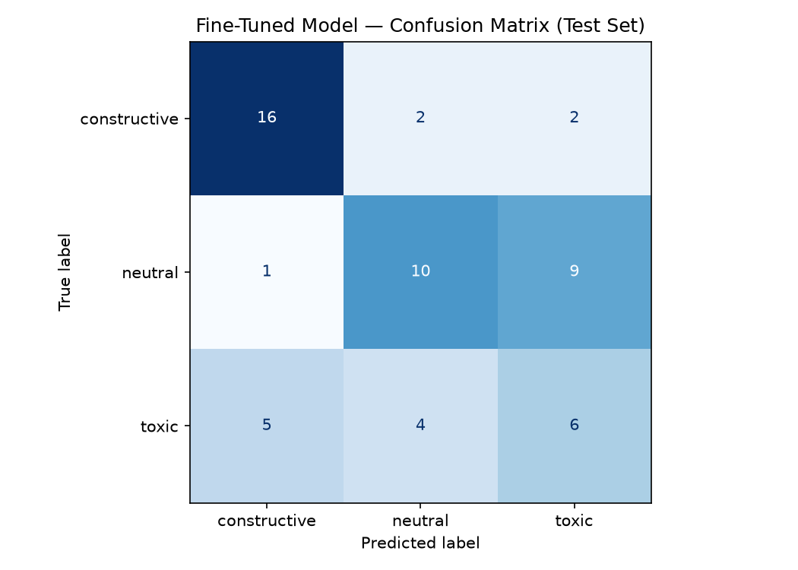

# TakeMeter: a discourse-health classifier for r/VALORANT

This is a fine-tuned `distilbert-base-uncased` model that sorts Valorant comments by
discourse health, meaning how a comment adds to (or wrecks) a conversation rather than
whether its opinion is right. I also run a zero-shot `llama-3.3-70b-versatile` baseline
on Groq so there's something to compare the fine-tuned model against.

Demo video (3-5 min): https://youtu.be/Nc5eB1aua3g

The full taxonomy, edge-case rules, and decisions are in [`planning.md`](planning.md).

How the code is laid out, since there's a notebook and some scripts:

- `takemeter.ipynb` is the full train / evaluate / baseline pipeline, meant to run on
  Colab with a T4 GPU. It's the canonical notebook.
- `scripts/run_local.py` mirrors that notebook exactly (same split, same seed, same
  hyperparameters) so it runs on a local GPU. This is the one I actually ran, and it's
  what produced the committed `confusion_matrix.png` and `evaluation_results.json`. The
  notebook reproduces the same thing on Colab, give or take small hardware variance.
- `scripts/scrape_arctic.py`, `label_bootstrap.py`, and `build_csv.py` are the data
  pipeline (scrape, draft labels, clean and balance to the CSV).
- `scripts/classify.py` is a small inference helper that loads the trained model and
  prints a label and confidence for any post. It's what I use in the demo video.

## 1. Community and task

I picked r/VALORANT and r/ValorantCompetitive because I've played the game for a couple
of years, and that turned out to matter more than anything else in the project. Labeling
is the hard part, and you can only label consistently if you actually know what the
community sounds like.

What I'm measuring is discourse health: a `constructive` to `toxic` axis with `neutral`
in the middle. I'm not scoring whether a take is correct, only how it's said and whether
it gives anything to the conversation.

## 2. Label taxonomy (3 labels)

| Label | Definition |
|---|---|
| `constructive` | Adds value: a reasoned argument, helpful advice (lineups, strats, settings), real analysis, or a respectful answer even when it disagrees. |
| `neutral` | On-topic but low-substance and not hostile: chatter, jokes, one-line reactions, plain facts, simple questions, undirected venting. |
| `toxic` | Hostile or corrosive: insults, flaming, personal attacks, teammate-blaming as abuse, slurs, contemptuous dismissal. |

Each comment gets exactly one label, and the three cover basically everything I saw.
Off-topic junk and noise go in `neutral`, so I never needed an "other" bucket. The
tricky rulings (helpful but rude, undirected venting, sarcasm) are written down in
`planning.md`. I settled those before labeling started and then stuck to them, which is
the only way the labels stay consistent once you're 200 comments deep and tired.

Two examples each:

- `constructive`
  - "Stop shooting while moving, counter-strafe first. Your first bullet is only accurate when you're fully stopped."
  - "For Cypher on Bind, drop your cage in the doorway and trip behind it so you still get the rotate info if they push."
- `neutral`
  - "honestly ranked has felt so miserable this whole act lol"
  - "wait is the new episode dropping today or next week?"
- `toxic`
  - "you're hardstuck iron for a reason, uninstall and stop queuing with us trash"
  - "imagine maining Phoenix in 2024 and still going 4/18, actual bot"

## 3. Data

The comments come from r/VALORANT and r/ValorantCompetitive. I wanted to scrape them
straight from Reddit, but Reddit's API gave me HTTP 403 on both the public JSON
endpoints and the OAuth path, from two different machines. So I pulled the same comments
from the Arctic Shift archive instead (`scripts/scrape_arctic.py`), which is a public
mirror of Reddit data on separate infrastructure. Same comments, just a route that
wasn't blocked.

I sampled 616 comments across ten time windows from 2023 to 2025 in both subreddits, 32
per window, so the set isn't all from one patch cycle or one piece of drama. `toxic` is
rare on a moderated subreddit, so I also did a text search on a few confrontational
words to find more candidates for that class. The search only decided which comments I
looked at. It never decided the label.

Cleaning happens in `scripts/build_csv.py`: I strip quote blocks, `u/` and `@` mentions,
`r/` references, URLs, and markdown so the model can't cheat off formatting. The text is
the standalone comment, with no parent context glued on.

For labeling, I had gpt-4o-mini do a first pass against the rubric
(`scripts/label_bootstrap.py`), then spot-checked the results by hand, going toxic-first
since that's where the draft was least reliable. I agreed with most of the calls and
left the labels as the model drafted them, which means there's some residual noise in
`toxic` that I come back to in the evaluation. I used gpt-4o-mini on purpose, because the
baseline is Groq's llama-3.3-70b. If the same model that I'm grading also wrote the
labels, the comparison would be rigged. (One funny side effect: Azure's content filter
refused to process a handful of the nastiest comments at all, which is its own kind of
`toxic` signal.)

`toxic` came out to about 16% of the 616, so I downsampled the two majority classes to
130 each (seed 42) and kept every toxic example. That gets every class over the 20% mark.
The split is a stratified 70/15/15 with `random_state=42`.

Label distribution of the final 361-example set:

| Label | Count | % |
|---|---|---|
| `constructive` | 130 | 36.0% |
| `neutral` | 130 | 36.0% |
| `toxic` | 101 | 28.0% |
| **Total** | **361** | 100% |

### Three comments that were genuinely hard to label

These are the ones where the words on the page and the actual social read point in
opposite directions.

1. "yea ur right my adr is dogshit lmfao hopefully ill improve that soon." There's an
   insult word in there, but it's pointed at the author's own stats, and they're
   agreeing with someone. I called it `neutral`. The word "dogshit" is a trap; what
   matters is who the negativity is aimed at.
2. "I hate passive value. I hate lurkers. I hate being shot in the back…" Three "I hate"
   clauses in a row read angry, but nobody's being attacked. It's venting about
   playstyles. By my undirected-frustration rule that's `neutral`, even though the
   bootstrap model called it `toxic`. This is exactly what the review pass is for.
3. "go work for valorant you're clearly talented." Every word is nice. In context it's a
   sarcastic shot at someone, so it's `toxic`. Sarcasm leaves no fingerprints, which
   makes it hard for me and brutal for the model (see the errors below).

## 4. Model and training

The base model is `distilbert-base-uncased` with a 3-class classification head. I train
for 6 epochs at `learning_rate=2e-5`, batch size 16, `max_length=256`,
`weight_decay=0.01`, `warmup_ratio=0.1`, with a class-weighted loss.

The hyperparameter decision I actually had to make was about warmup and epochs, and it
came from a bug in the starter defaults. With 252 training examples and batch size 16,
one epoch is only about 16 steps, so the default 3 epochs is roughly 48 steps total. The
default `warmup_steps=50` is larger than that. The learning rate spends the whole run
warming up and never reaches 2e-5 (it topped out around 1.56e-5), so the model barely
trains. `toxic` F1 was a flat 0.00. Switching to `warmup_ratio=0.1` so warmup scales
with the schedule, and bumping to 6 epochs, let validation accuracy climb from 0.31 to
0.63. That one change did more than anything else.

That fixed the underfitting but `toxic` was still getting ignored, since it's the
smallest class. Weighting the cross-entropy loss by inverse class frequency makes the
model pay for missing toxic comments, and that pulled toxic F1 up to about 0.38. Overall
accuracy stayed roughly flat, so it's a trade: I gave up a little top-line accuracy for a
model that doesn't pretend a whole class doesn't exist.

I set `set_seed(42)` and use `random_state=42` everywhere. Worth flagging that fine-tuning
on ~250 examples is noisy: accuracy bounces around 0.58 to 0.66 depending on the seed, so
I report the fixed-seed run and you should expect small differences on other hardware
(I trained on a local GPU, not the Colab T4).

## 5. Evaluation

Both models run on the same locked test set (`random_state=42`).

| Model | Accuracy |
|---|---|
| Zero-shot baseline (Groq `llama-3.3-70b-versatile`) | **0.783** |
| Fine-tuned DistilBERT | **0.582** |
| Difference (fine-tuning vs baseline) | **−0.201** |

Test set is 55 examples (15% of 361, stratified). The fine-tuned model lost to the
zero-shot baseline, and I think that's the most interesting thing in the whole report.
A 70B instruction-tuned model already knows what gaming trash talk sounds like before it
sees a single training example. My 67M-parameter model is learning that from ~250 partly
noisy examples, and it can't catch up. Fine-tuning bought me a small, fast model I can
host myself. It cost about 20 points of accuracy to get there.

One caveat on the comparison: the baseline is scored on the 46 of 55 responses that
came back as a clean label (9 didn't parse and got dropped, which is what the notebook
does too), while the fine-tuned model is scored on all 55. Same test split, slightly
different denominators.

### How the baseline was run

The baseline is `llama-3.3-70b-versatile` on Groq, zero-shot, at `temperature=0` and
`max_tokens=20`. The system prompt gives it the task, the three label definitions, and
one example each, and tells it to reply with only the label name:

```
You are classifying comments from the Valorant gaming community (Reddit).
Judge each comment by DISCOURSE HEALTH, how it contributes to the conversation,
NOT whether its opinion is correct.

constructive: Adds value, a reasoned argument, helpful advice, real analysis, or a
respectful answer even when disagreeing.
Example: "Stop shooting while moving, your bullets only land when you're stopped."
neutral: On-topic but low-substance and not hostile, chatter, jokes, reactions, plain
facts, simple questions, or undirected venting.
Example: "honestly ranked has felt so miserable this act lol"
toxic: Hostile or corrosive, insults, flaming, personal attacks, contemptuous put-downs.
Example: "you're hardstuck iron for a reason, uninstall and stop queuing with us trash"

Respond with ONLY the label name: constructive, neutral, or toxic.
```

I send each test comment as the user message, lowercase the reply, and match it against
the three label strings (longest first, so a substring can't match the wrong label). If
the reply doesn't contain any of them it's counted unparseable and dropped from the
baseline's accuracy. The full prompt and the parsing loop are in `takemeter.ipynb`
Section 5 and in `scripts/run_local.py`.

### Per-class metrics (fine-tuned)

| Label | Precision | Recall | F1 | Support |
|---|---|---|---|---|
| `constructive` | 0.73 | 0.80 | 0.76 | 20 |
| `neutral` | 0.62 | 0.50 | 0.56 | 20 |
| `toxic` | 0.35 | 0.40 | 0.38 | 15 |
| **macro avg** | **0.57** | **0.57** | **0.56** | 55 |

### Confusion matrix



Same thing as a table (rows are the true label, columns are what the model predicted):

| true ↓ / pred → | constructive | neutral | toxic |
|---|---|---|---|
| **constructive** | 16 | 2 | 2 |
| **neutral** | 1 | 10 | 9 |
| **toxic** | 5 | 4 | 6 |

`constructive` is the cleanest row (16 of 20 right). The worst cell is `neutral`
predicted as `toxic`: 9 of the 20 neutral comments. That's the class weighting showing
its bill. I pushed the model to reach for `toxic`, and now it slaps that label on
ordinary chatter whenever a spicy word shows up. `toxic` itself scatters across all three
predictions, which tells me the model never found a reliable signal for it.

### Sample classifications

Five posts run live through the fine-tuned model (`scripts/classify.py`), showing the
predicted label and the model's confidence:

| Post | Predicted | Confidence | Right? |
|---|---|---|---|
| "Stop shooting while moving, counter-strafe first. Your first bullet is only accurate when you're stopped." | constructive | 68% | yes |
| "you're hardstuck iron for a reason, uninstall and stop queuing with us trash" | toxic | 52% | yes |
| "honestly ranked has felt so miserable this whole act lol" | toxic | 48% | no (neutral) |
| "he has 340k followers mostly from fortnite so he loses a lot every day" | neutral | 41% | no (toxic) |
| "yea ur right my adr is dogshit lmfao hopefully ill improve that soon" | toxic | 46% | no (neutral) |

The correct one worth explaining is the first. It's straight gameplay advice with a
concrete instruction (counter-strafe, stop before firing), and the model lands on
`constructive` at 68%, its highest confidence of the five. That's the case where the
words and the intent line up: helpful content, helpful vocabulary, nothing adversarial.
Notice how much lower the confidence is on the others (41 to 52%) once tone and intent
stop matching the surface words.

### Three errors, with my read on them

All from the fine-tuned model's wrong predictions on the test set, seed 42.

1. "My super hot take is that Ascent doesn't get the hate it deserves and this
   community's love for it is the biggest…" Labeled `toxic`, predicted `constructive`,
   and it was confident about it (0.79). The contempt is aimed at the community, but
   "hot take" plus an argument shape looks like analysis. The model went with the
   structure and ignored the attitude.
2. "he has 340k followers mostly from fortnite so he loses a lot every day." Labeled
   `toxic`, predicted `neutral` (0.41). It's a sneer with no profanity and no caps, so it
   reads like a plain fact. With nothing to grab onto, the model saw nothing toxic.
3. "yea ur right my adr is dogshit lmfao hopefully ill improve that soon." Labeled
   `neutral`, predicted `toxic` (0.46). The opposite mistake. "dogshit" is an insult
   word so the model flagged it, but the comment is self-deprecating and friendly. The
   model learned toxic vocabulary, not toxic intent. (This is hard case #1 from above.)

### What the model learned versus what I wanted

I wanted something that judged whether a comment helps, takes up space, or poisons the
thread. What I got is a model that learned a shallower stand-in for that: certain words
and a certain sentence shape. Profanity and a few trigger words drag a comment toward
`toxic`. Strategy vocabulary and argument-shaped sentences drag it toward
`constructive`. Everything else lands in `neutral`.

The errors show both ends of that gap. It misses contempt and sarcasm that don't use any
toxic words, and it false-alarms on neutral comments that happen to contain a charged
one. For a 67M model on a couple hundred subjective examples, that's about what you'd
expect. It picked up the words that correlate with my labels, not the social judgment
underneath them. `toxic` is the hardest class (F1 0.38) because Valorant hostility is
usually about tone and context, not swearing. The baseline result makes the same point
from the other side: the 70B model reads these comments better at 0.78 than mine does at
0.58, because it learned what contempt sounds like from the whole internet, while mine
had ~250 noisy examples and mostly memorized the vocabulary. More data and cleaner labels
on the subtle toxic cases are where I'd go next.

## Spec reflection

One way the spec helped: it pushed label design to the front and gave hard constraints
(one label per comment, ~90% covered without an "other" bucket, at least 20% per class).
That forced me to write the edge-case rules in `planning.md` before I touched any data,
and those rules are the only reason the labels stayed consistent. Without that pressure I
would have started labeling first and discovered my categories were mushy 150 comments in.

One way I diverged: the spec assumes you scrape Reddit directly and train on Colab. Reddit
blocked its API from both my machine and my dev environment, so I pulled the same comments
from the Arctic Shift archive instead, and I trained locally on my own GPU rather than
Colab. I also added two things the starter didn't have: a fix for the warmup-vs-steps bug,
and a class-weighted loss to stop the `toxic` class from collapsing. The notebook is
updated to match so it still reproduces on Colab.

## AI usage

I used AI tools in a few specific places and reviewed the output each time.

- Annotation (disclosed): I had `gpt-4o-mini` (Azure) draft a first-pass label for all 616
  comments against my `planning.md` rubric. I then spot-checked them myself, toxic-first.
  I picked gpt-4o-mini on purpose because the baseline is Groq's llama-3.3-70b, and reusing
  the baseline model as the label source would have rigged the comparison. The drafts were
  decent but over-eager on `toxic`, tagging some mild sarcasm and self-deprecation as
  hostile. I agreed with most of them and kept the committed labels mostly as the model
  produced them, so that residual noise is part of why `toxic` is the weakest class, which
  I flag in the evaluation rather than papering over.
- Pipeline and debugging: I used Claude Code to write the data scripts (scraper, label
  bootstrap, CSV builder, local trainer) and to help debug why the fine-tuned model was
  scoring `toxic` at F1 0.00. The useful catch there was that the starter's
  `warmup_steps=50` was larger than the total number of training steps (~48), so the
  learning rate never ramped up. I took that diagnosis, switched to `warmup_ratio` plus
  more epochs, and made the call to add class-weighted loss and accept slightly lower
  overall accuracy in exchange for a model that predicts `toxic` at all.

## Reproduce

```bash
uv sync
# 1. pull comments from the Arctic Shift archive (no credentials needed)
uv run python scripts/scrape_arctic.py        # -> data/raw/comments.jsonl
# 2. draft labels with gpt-4o-mini, then review data/labeled.jsonl by hand
uv run python scripts/label_bootstrap.py      # needs AZURE_FOUNDRY_* (or GROQ) in .env
# 3. clean and balance into the training CSV
uv run python scripts/build_csv.py            # -> data/valorant_takes.csv (361 rows)
# 4a. train and evaluate locally (needs a GPU + a valid GROQ_API_KEY for the baseline)
uv run python scripts/run_local.py            # -> confusion_matrix.png, evaluation_results.json
# 4b. or run takemeter.ipynb on Colab (T4 GPU) with a GROQ_API_KEY secret
# 5. classify posts with the trained model (used in the demo video)
uv run python scripts/classify.py                 # built-in demo posts
uv run python scripts/classify.py "your comment here"
```

`scripts/scrape_reddit.py` is the direct Reddit version. I'm keeping it for reference,
but Reddit blocked it from my IPs, so `scrape_arctic.py` is the one that actually ran.

Artifacts to commit: `data/valorant_takes.csv`, `confusion_matrix.png`,
`evaluation_results.json`, `takemeter.ipynb`, `planning.md`.
